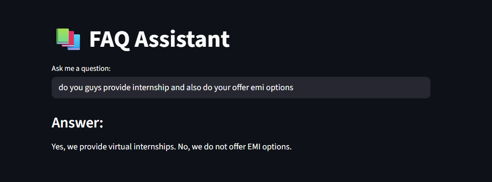

### 1. **Project Title**
# GeminiPALM-FAISS-FAQ-Assistant

Flow diagram
    * CSV/Knowledge Base → Embeddings → FAISS Vector Store → Retriever → Gemini LLM → User Query → Answer

---

### 2. **Demo Screenshot**

[](https://github.com/akashkanumetta/GeminiRAG-FAQ/blob/main/App%20Screenshot.png)

---

### 3. **Project Description**

  > This is a Generative AI-powered FAQ chatbot that can answer questions from a custom dataset (CSV of FAQs).
  > It uses **LangChain** for orchestration, **FAISS** for similarity search, and **Google Gemini (PaLM)** as the LLM.
  > The chatbot not only answers questions from the dataset but also generalizes to related questions using semantic similarity.

---

### 4. **Features**

✅ Train on any CSV file (FAQs, documents, knowledge base)

✅ Vector-based similarity search using FAISS

✅ Uses HuggingFace embeddings (`all-MiniLM-L6-v2`)

✅ Answers even **unseen queries** (not directly in CSV)

✅ Integrated with **Google Gemini LLM**

✅ Simple **Streamlit UI**

---

### 5. **Architecture Diagram**

User Query → Embeddings → Vector Search (FAISS) → Context → Gemini LLM → Answer

---

### 6. **Tech Stack**

* **LangChain** – Orchestration & QA Chain
* **Google Gemini (PaLM)** – LLM
* **FAISS** – Vector Database
* **HuggingFace** – Sentence Embeddings
* **Streamlit** – Web UI
* **Pandas** – Data Loading

---

### 7. **Installation & Setup**

```bash
# Clone repo
git clone https://github.com/username/faq-chatbot.git
cd faq-chatbot

# Create venv
python -m venv venv
source venv/bin/activate   # On Windows: venv\Scripts\activate

# Install dependencies
pip install -r requirements.txt

# Add your Google API Key in .env
echo GOOGLE_API_KEY="your_api_key_here" > .env
```

---

### 8. **Usage**

```bash
# Run Streamlit app
streamlit run app.py
```

* Open browser at `http://localhost:8501`
* Start chatting 🚀

---

### 9. **Project Structure**

```
📦 faq-chatbot
 ┣ 📜 main.py          # Streamlit frontend
 ┣ 📜 utils.py        # VectorDB & QA chain helper functions
 ┣ 📜 requirements.txt
 ┣ 📜 gpalm.py
 ┣ 📜 README.md
 ┗ 📂 assets          # Images/screenshots
```

### 10. **Credits & References**

* [LangChain Docs](https://python.langchain.com)
* [Google AI Studio](https://aistudio.google.com)
* [FAISS](https://github.com/facebookresearch/faiss)
